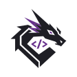

<h1 align="center">👋 Olá, eu sou a Alícia Maia</h1>

  <strong>Engenheira de Computação | QA Automation Engineer | Mojo Code</strong> 
  💡 Garantindo a qualidade, performance e escalabilidade de produtos digitais

  
  
  

---

## 👩‍💻 Sobre mim

Sou **Engenheira de Computação** e atualmente pós-graduanda em **Automação de Testes de Software (PGATS)** pela Faculdade VINCIT. Minha abordagem foca em transformar a qualidade em uma cultura estratégica para o desenvolvimento de produtos robustos.

* 🎯 **Atuação Atual:** Atuo como QA Engineer - Freelancer na **Mojo Code**, sendo responsável por todo o ciclo de qualidade, desde o planejamento e testes manuais até a implementação de automação e análise de métricas de desempenho.
* ⚙️ **Stack e Foco:** Especialista em testes End-to-End e de API com **Cypress**, **Playwright**, **K6** e **Postman**. Possuo sólida compreensão de arquiteturas modernas em **React**, **Next.js** e **TypeScript**.
* 🌱 **Comunidade e Educação:** Tenho um forte compromisso com o compartilhamento de conhecimento, tendo atuado como **tutora de informática básica** no Programa de Tutoria Discente (PTD) Castanhal e como bolsista no projeto **Meninas Pai D’Éguas**, ensinando robótica para mulheres.

---

## 🛠️ Tecnologias & Ferramentas

**Quality Assurance & Automação**
 

**Desenvolvimento & Gestão**
 

---

## 💼 Experiência Profissional

*QA Engineer - Freelancer* \
**Mojo Code** \
Liderança técnica dos processos de qualidade, planejamento estratégico de testes e implementação de automação de alto impacto. \
Abr 2026 - Presente

 
 

*QA Lead* \
**Castanhal On** \
Liderança da estratégia de qualidade e automação da plataforma. Execução de testes manuais e automatizados com foco em estabilidade. \
Nov 2025 - Abr 2026

 
 

*Vice-presidente* \
[*LinkJr*](https://linkjr.com.br/) • Empresa Júnior \
Gestão executiva de equipes e liderança de projetos de tecnologia. \
Languages & Technologies: `Cypress`, `React`, `Next.js`, `TypeScript` \
Ago 2024 - Abr 2025

 
 

*Bolsista / Instrutora de Robótica* \
**Projeto Meninas Pai D’Éguas** \
Capacitação tecnológica e fomento ao empoderamento feminino em áreas de STEM através do ensino de robótica. \
Ago 2024 - Set 2025

 
 

*Tutora de Informática* \
**Programa de Tutoria Discente (PTD) Castanhal** \
Ensino de conceitos fundamentais de informática, auxiliando no desenvolvimento técnico de estudantes da comunidade. \
Ago 2023 - Jul 2024

 

---

## 📜 Certificações e Formação Complementar

* **FAST em Engenharia de Qualidade** | *César School*
* **Bootcamp de Quality Assurance** | *Atlântico Avanti & SOFTEX*
* **Mentoria em Testes de Software** | *Júlio de Lima*

---

## 📊 GitHub Stats

<!-- 

  
  

 -->

  

 

  

